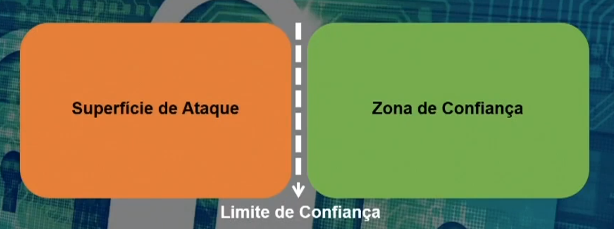
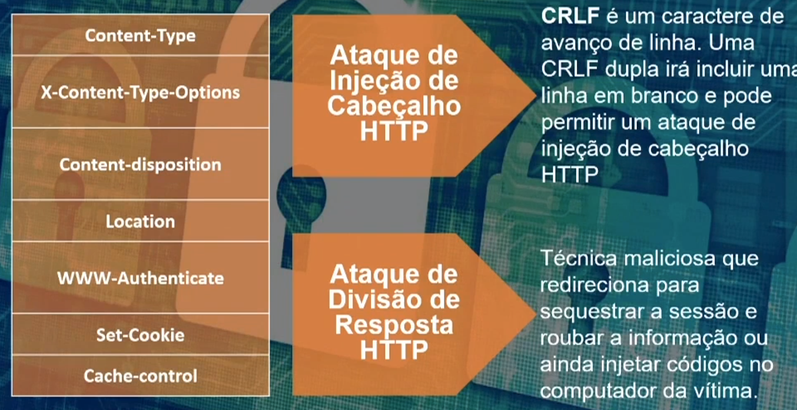

## Seção 1: Webinar — Como se tornar especialista em Desenvolvimento Seguro de Software

### Objetivos

- Reconhecer a tensão entre as exigências do mercado e a segurança.
- Explicar o jargão de segurança e `STRIDE`
- Descrever questões de segurança HTTP
- Explicar o modelo de segurança do navegador

### Causas do Software Inseguro

Escrever um 'software' seguro é talves a forma mais efetiva de previnir a maioria dos crimes cibernéticos que existem atualmente. Como programadores, temos influência para previnir contra o software falho. Alguns softwares têm segurança falaha por alguns motivos, como:

- Falta de tempo ou falta de dinheiro
- O cliente não solicitou
- Falta de conhecimento
- Más Intenções
- Niguém vai querer invadir o meu software

### O que é Segurança?
A segurança pode ser definida como a proteção contra ameaças.

#### Jargões de Segurança

- `Fraqueza`: Uma construção errada que pode prejudicar o sistema e reduzir a segurança.
- `Vulnerabilidade`: Uma fraqueza que pode ser explorada.
- `Explorar`: Abusar de uma vulnerabilidade específica, tirar proveito com más intenções de alguma falha específica do sistema.
- `Ataque`: Uma tentativa de abusar do sistema, uma tentativa de acesso sem autorização a um sistema.
- `Ameaça`: Um potencial ataque.
- `Mitigar`: Uma medida para diminuir o impacto da ameaça.
- `Path ou Remendo`: Uma medida para remover a vulnerabilidade de um sistema, corrigir uma falha de uma sistema.
- `Risco`: Uma potencial perda de valor, usualmente expressada como a probabilidade do impacto de perder onde se poderia ganhar.

### Propriedades de Segurança

#### São propriedades de Segurança
- `Autenticação`: Verifica a identidade, se a pessoa ou algo é realmente quem alega ser.
- `Integridade`: A informação deve manter as características originais estabelecidas pelo dono da informação.
- `Não repúdio`: Impossibilidade de negar a autoria em relação a uma transação feita.
- `Confidencialidade`: O acesso deve ser realizado apenas por pessoas autorizadas.
- `Disponibilidade`: A informação deve estar sempre disponível a usuários autorizados.
- `Autorização`: Verifica os privilégios, se a pessoa ou algo tem permissão para acessar algum recurso ou informação.

### STRIDE

<table>
    <thead>
        <th>S</th>
        <th>Spoofiling</th>
        <td>Forjamento de identidade</td>
        <td>fingir ser algúem ou algo que você não é</td>
        <td>Autenticação</td>
    </thead> 
    <thead>
        <th>T</th>
        <th>Tampering</th>
        <td>Adulteração de Dados</td>
        <td>Modificar dados armazenados ou dados em trânsito</td>
        <td>Integridade</td>
    </thead> 
    <thead>
        <th>R</th>
        <th>Repudiation</th>
        <td>Rejeição</td>
        <td>Negar que fez ou não fez algo</td>
        <td>Não Repúdio</td>
    </thead> 
    <thead>
        <th>I</th>
        <th>Information Discosure</th>
        <td>Divulgação de Informações</td>
        <td>Ver informações que você não está permitido ver</td>
        <td>Confidencialidade</td>
    </thead> 
    <thead>
        <th>D</th>
        <th>Denial of Service</th>
        <td>Recusa de Serviço</td>
        <td>Negar um serviço, deixar o sistema indisponível.</td>
        <td>Disponibilidade</td>
    </thead> 
    <thead>
        <th>E</th>
        <th>Elevation of Privilege</th>        
        <td>Elevação de Privilégio</td>
        <td>Fazer algo sem permissão</td>
        <td>Autorização</td>
    </thead>
</table>

### Superfície de Ataque e Zonas Confiáveis

`Defesa em Profundidade` administra o risco, de modo que se uma camada de defesa é inadequada, outra camada de defesa irá impedir a violação completa. 
`Falha Segura`: configura o tratamento de possíveis falhas do sistema que tratam os possíveis erros que o ‘software’ se concretize.

### Protocolo HTTP

O HTTP é um protocolo que consiste em requisição e resposta. Possui dois métodos principais que são:

- `GET`: é destinado a operações de leitura
- `POST`: modifica o estado do aplicativo

> O Padrão HTTP não é claro em certos aspectos. Isso pode levar a equivocos. Este problema é chamado de `Poluição de Parâmetro` ou `HTTP` - HTTP Parameter Pollution. São falhas no processo de validação de entrada de dados.

> **Código 404**
> Recurso não encontrado

> **Código 403**
> Acesso proibido

> **Código 401**
> Janela de login

> **Código 302**
> Redireciona a página para a URL especificada no cabeçaçho `"Location"`

> **Código 200**
> Tudo ok

### Solicitação GET

GET é mais rápido, envia somente texto, anexada à própria URL, tem uma limitação de 255 caracteres

### Cabeçalho de Resposta HTTP

### SOP - Política de Mesma Origem

Política de Mesma Origem ou Same Origin Policy - `SOP`

- Descreve sob quais condições scripts e programas em sites podem acessar o conteúdo em outros sites.
- Os detalhes desta política diferem por navegadores e até por versão dos navegadores.

### Revisão

- Jargões e Princípios de Segurança
- STRIDE
- Superfícies de Ataque e Zonas de Ataque
- Defesa em Profundidade e Falhar Seguro
- GET e POST
- HTTP e Códigos de Status
- Cabeçalho HTTP
- Ataque no Cabeçalho da Resposta HTTP
- Política de Mesma Origem