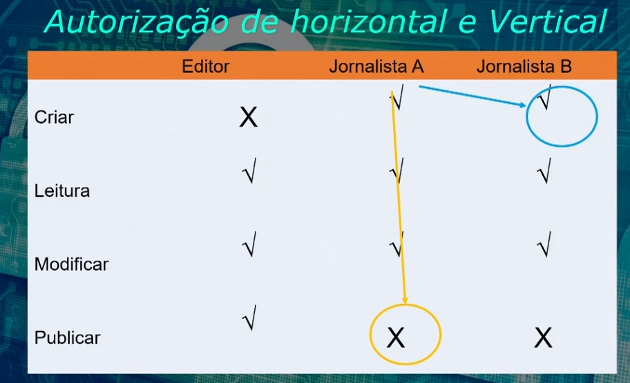
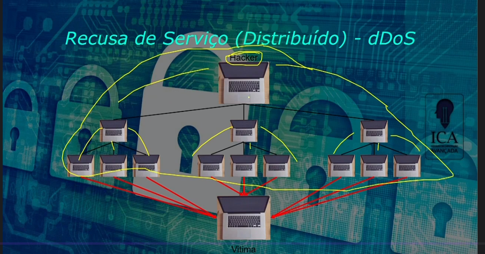

## Autorização, Configuração, Manejo e Registro de Erros

### Objetivos

- Reconhecer a diferença entre autorização horizontal e vertical.
- Reconhecer a diferença entre referências diretas e indiretas.
- Reconhecer envenenamento de sessão e condições de corrida.

### Problemas de Autorização

- Escalonamento de Privilégios;
- Acesso a Objetos Não Autorizados;

Como mitigar estes problemas?

Condições de corrida (ataque TOCTOU)

### Exercício 

Qual a diferença entre Autorização e Autenticação?

A - Autorização é o processo de verificar a identidade de alguém e Autenticação é o processo de verificar se algúem tem permissão para realizar uma operação.

B - Autenticação é o processo de verificar a identidade de alguém e Autorização é o processo de verificar se algúem tem permissão para realizar um operação.

C - Autenticação e Autorização são processos para verifciar a identidade de alguém.

D - Autenticação e Autorização são processos para verificar se alguém tem permissão para realizar uma operação.

### Configuração, Manejo e Registros de Erros

### Objetivos

- Justificar a necessidade de endurecimento.
- Reconhecer métodos de endurecimento.
- Reconhecer diferentes vazamentos de informação.
- Explicar a importtância do registro para segurança.
- Explicar o princípio de 'Falhar com Segurança'.
- Reconhecer ataques por recusa de seriço e mitigações.

### Componentes de Terceiros, Configuração e Endurecimento

- Aplicando os patcher ou correções de segurança mais recentes.
- Restringir o acesso a funcionalidades perigosas.
- Configurando privilégios de acesso.
- Desativar ou remover recusros de depuração (debug)
- Removendo arquivos desnecessários
- Alterando senhas padrão.

### Vazamento de informações

- Inocente?

- Não ajude o hacker.

Exemplos de vazamento:
- Comentário HTML
- Informações sobre a versão
- Rastreamento de Pilha, IP e servidores em Produção
- Endereços de e-mail pessoais

### Como evitar definitivamente vazamentos de informações

- Os cabeçalhos de resposta HTTP vazam informações de versão, permitindo ao invasor procurar vulnerabilidades específicas.
- As páginas de erro pode exibir exatamente como o erro aconteceu, dando ao atacante pistas de como a vulnerabilidade poderia ser explorada.
- Endereços IP internos e caminhos de servidores ajudam o atacente a definir novas metas depois que um sistema tenha sido comprometido ou se o atacanete usa o browser de alguém para realizar ataques de dentro.
- Comentários nas páginas HTML mostrando os nomes e e-mail ajudam a realizar o ataque de engenharia social. 
- Arquivo de gerenciamento de versão podem vazar informações do código da aplicação.

### Manejo e Registro de erros

- Falahar de forma segura!
- Guarde todas as informações necessárias para detectar um atque.(Logs)
- Tratamento de Erros.
- Registro de Erros ou Log.

### 5 Dicas para mitigar o dDos

Mitigar:
- Limitar a quantidade de recursos que podem ser alocados.
- Utilizar ferramentas que auxiliam contra o DoS ou DDoS.
- Aplicar patches de segurança.
- Limitar o tamanho da banda.
- Contruir um plano de contingência.

### Exercício 

Qual das alternativas lista um meio de endurecimento, cidando reduzie a superfície de ataque de um software?

A - Evitar aplicar patches ou pacotes de correção;? 
B - No caso de erro, exibir registro com todos os IPs utilizados, inclusive dos servidores de produção internos; 
C - `Alterar senhas padrão;` 
D - Manter acesso a funcionalidades perigosas ou desnecessárias. 